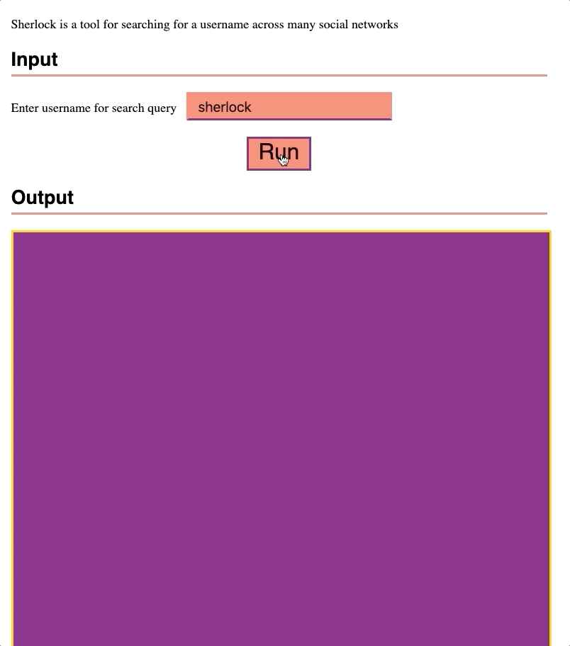

# cli-gui

An attempt to make cli tools easier to use. I'm not totally sure if it succeeds, but I'd be down to hear what you think.

More specifically, it is a a web interface with an HTML form that runs a CLI tool with the values from the form. The CLI tool is run with docker, and therefore any supported CLI tools must be a docker image on the host.

## Contributing

There's a bunch of ways that I'd love to get your help with this project.

1. Give me some feedback on it :)
1. Add a new CLI tool
1. Work on `cli-gui` itself

### Adding a CLI tool

Great, just make a Dockerfile in `Dockerfiles` similar to the one named `sherlock`. The name of the file will be what the docker image is tagged with and will end up being in the URL. Then run `npm run build-docker` which will ensure everything is ready to go. That tool is now available to `cli-gui` but we have to configure it. We need to add another object to the `tools` array in `config.js`.

An object in the tools array should have the following keys:

Name | Type | Description
--- | --- | ---
id | string | The tag of the related Docker image, also will be the URL
image | string | The tag with version of the related Docker image
description | string | Shown in the UI to the user to describe the tool's purpose
fields | array | The fields that should be shown in the UI, which should map to the tool's CLI options
format | function | Passed an object of the fields (key is the field name, value is the value) and returns a string which is the options passed to the tool.

An object in the fields array should have the following keys:

Name | Type | Description
--- | --- | ---
name | string | Will be used for the name of the field and will be the key value passed to the `format()` function
label | string | Description of the field, shown in the web UI next to the field
defaultValue | string | The default value for the field
type | string | Represents the type of input shown in the UI, supports "string", "date", "select"
options (optional) | array | An array of strings that will be <option> elements in field with a type of "select"
